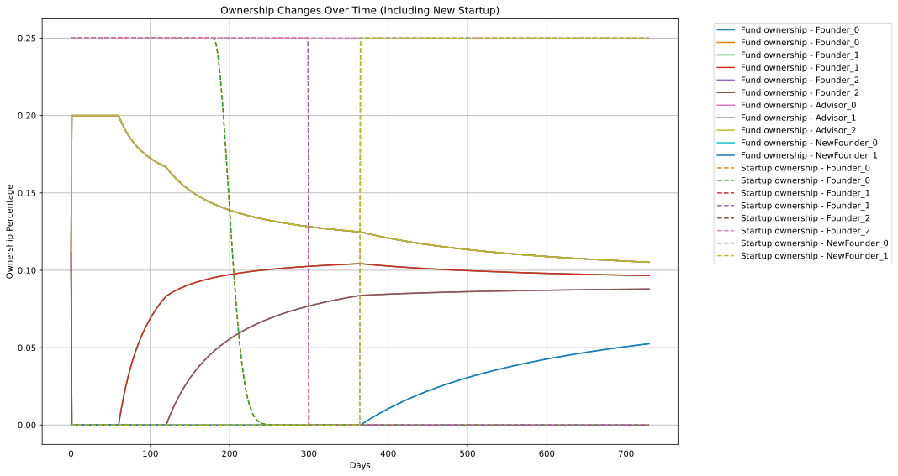
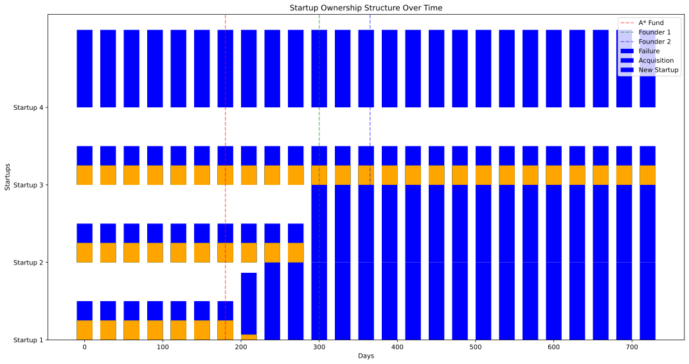

# Founders' Cooperatives

How to organize ownership around an important mission.

This graph shows the evolution of ownership in a startup fund over two years. The fund begins with three startups, each having two founders, plus three advisors. Ownership percentages change as time passes due to vesting. After 6 months, one startup fails, causing its founders' ownership to decline. At 10 months, another startup is acquired, boosting the fund's value. One year in, a new startup with two founders joins, reshuffling ownership percentages. Throughout, advisors' fund ownership gradually decreases as more founders vest, while successful founders see their combined fund and startup ownership increase. The simulation demonstrates how this ownership model adapts to various events like failures, acquisitions, and new entrants.

This graph shows how startup ownership is split between the A* fund and founders over two years. At first, it's 50-50. When startups fail or get bought, their founders' shares shrink. When new startups join, the chart gets more colorful as new founders appear. The A* fund's portion (likely at the bottom) stays big but wiggles as things change.
